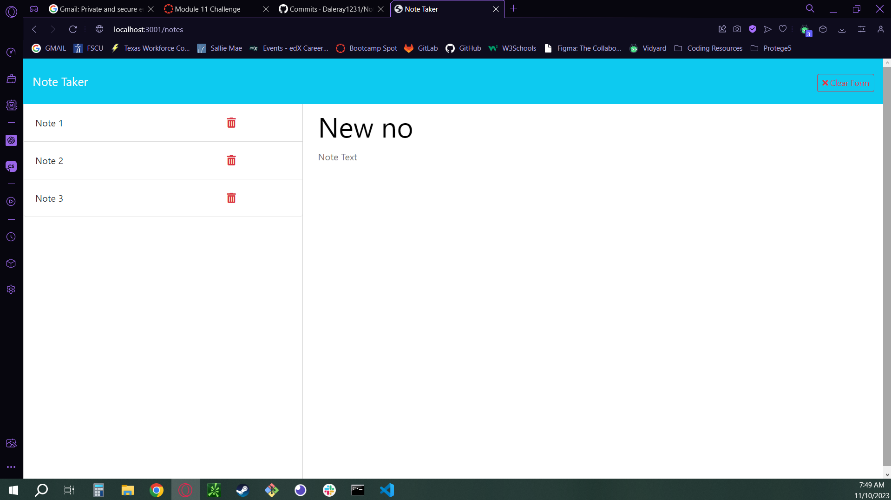

# Note Taker App

This application serves as a note-taking platform using Express.js.

## Overview

The Note Taker app allows users to create, save, view, and delete notes. It provides a simple and intuitive interface for managing personal notes, accessible through a web browser.

## Features

- **Create Notes:** Users can create new notes with a title and text content.
- **Save Notes:** Notes can be saved for future reference.
- **View Notes:** Access and view the existing notes from the list.
- **Delete Notes:** Remove unwanted notes from the list.

## Technologies Used

- **Frontend:** HTML, CSS, Bootstrap, JavaScript
- **Backend:** Node.js, Express.js
- **Storage:** File system handling (fs module), database handling (JSON files)
- **Miscellaneous:** UUID for unique ID generation

## Usage

1. Clone or download the repository.
2. Install necessary dependencies using `npm install`.
3. Run the application with `node server.js`.
4. Access the app through a web browser via `http://localhost:<PORT>`, where PORT is the defined server port (default is 3001).
5. Start creating, saving, and managing notes.

## Notes

- The project contains both the frontend HTML/CSS and backend Node.js code.
- File handling is done to store notes persistently in the `db.json` file.

## Credits

This application was built as part of a learning experience using Express.js and file system handling in Node.js.

Github Repo: https://github.com/Daleray1231/Note_Taker   
Github Deployed Application: https://daleray1231.github.io/Note_Taker 

